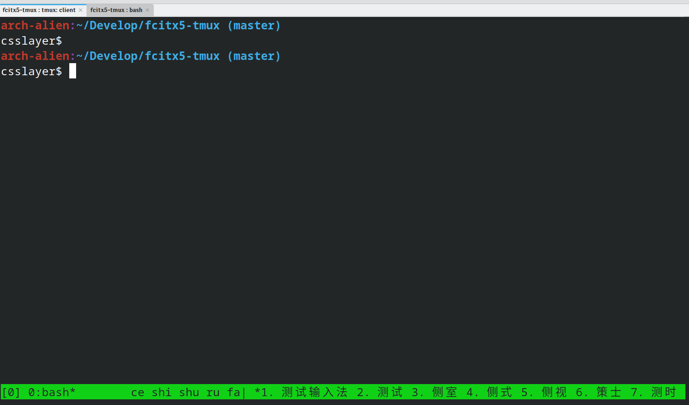

A Tmux Fcitx client
====================


What this project is:

Make tmux a fcitx client. It allows you to type with input method without using graphical display server. For example, you can type with Fcitx under TTY.

What this project is not:

Display fcitx state in tmux. That is not the goal of this project.

Dependenices:

1. Need fcitx5 to compile
2. Need dbus-send to run.

Compile:
```
mkdir build
cd build
cmake .. -DCMAKE_INSTALL_PREFIX=/usr
cmake --build .
sudo cmake --install .
```

Usage:
Add following content to ~/.tmux.conf
```
run /usr/share/tmux-fcitx5/fcitx5.tmux
```

You will also need to use "#{@fcitx5}" in your status bar. For example:

To display candidate in status right and increase the length so it won't be truncated.

```
set -g status-right "#{@fcitx5}"
set -g status-right-length 120
```

Known issue:

Not all key combinition works, specially for modifier key only hotkey and key release event due to Tmux bind-key limitation.
Trigger key (Control+Space) repeatedly press functionality does not work properly. So you will see Control+space enumerate over different input method if you have more than one input method configured.

Keyboard layout related feature, including Key that relies on scan code won't work too, which is expected.

Term Type also matters, certain Key is only tested under Konsole.
